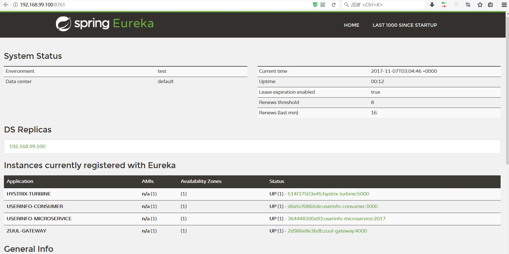

# Spring Cloud 容器化微服务

Docker容器内运行微服务，Eureka服务注册发现，Feign服务调用，Zuul微服务网关，Ribbon负载均衡，Hystrix服务容错保护/断路器

## Docker compose容器编排

先编译出jar文件：
```sh
mvn clean package
```

然后构建所有Docker镜像：
```sh
docker-compose build
```

容器内运行所有微服务：
```sh
docker-compose up -d
```

打开服务注册中心，可以看到服务均已注册


