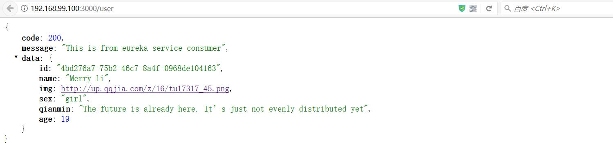
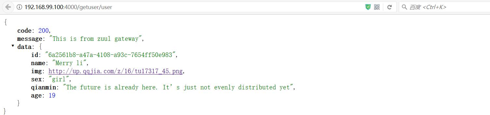
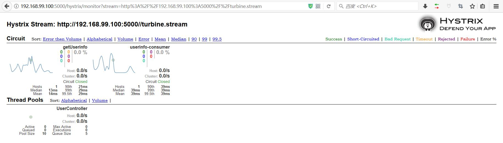

# Spring Cloud 容器化微服务

Docker容器内运行微服务，Eureka服务注册发现，Feign服务调用，Zuul微服务网关，Ribbon负载均衡，Hystrix服务容错保护/断路器

## Docker compose容器编排

为了加快构建速度，需要先编译出jar文件，再通过Dockerfile构建：
```sh
mvn clean package
```

然后构建所有Docker镜像：
```sh
docker-compose build
```

容器内运行所有微服务：
```sh
docker-compose up -d
```

### eureka-server 服务注册中心

打开 http://192.168.99.100:8761/ 查看服务注册情况


### server-provider 服务提供者

在2017端口提供了一个查询用户信息的API

打开 http://192.168.99.100:2017/userinfo


### feign-consumer 服务消费者

消费服务userinfo-microservice

访问 http://192.168.99.100:3000/user 返回结果



### zuul-gateway 微服务网关

用serviceId代替URL，实现动态路由

网关路由到userinfo-consumer的接口，返回结果被Zuul过滤器替换

访问 http://192.168.99.100:4000/getuser/user 注意这里每分钟限流请求10次



### hystrix-turbine 服务监控

打开 http://192.168.99.100:5000/hystrix 填入 `http://192.168.99.100:5000//turbine.stream` 查看服务运行状态


